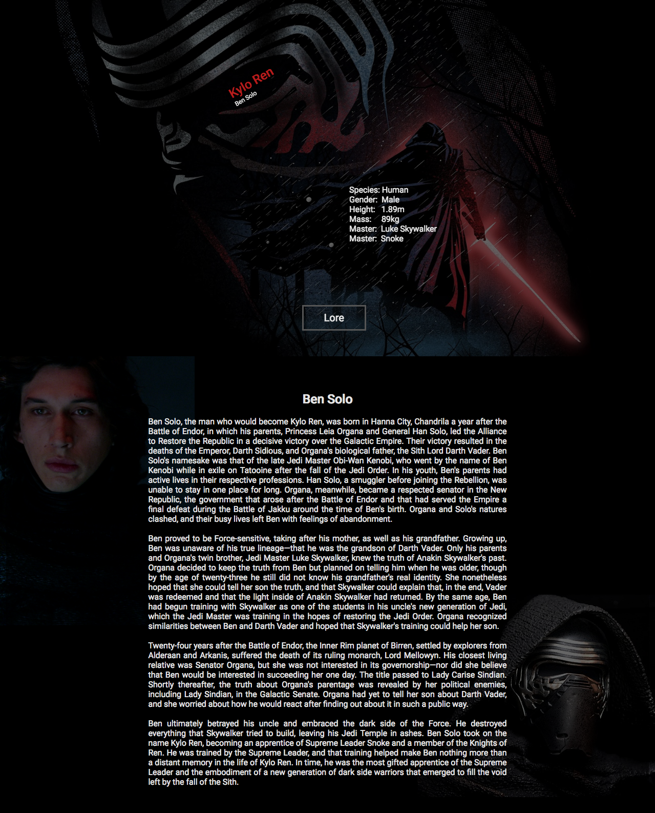

#Kylo Ren(June 2017)

The introduction page for Ben Solo/Kylo Ren was created as an exercise to refresh my memory of how elements positioning works. The page was created using a combination of position attributes like *relative* and *bold*, and some translate properties to push some elements to more unique positions.

The header inside the eye was positioned there with the help of the *translate* and *rotate* properties. This was more of an accident, because I just wanted to position it higher then the information, and quickly realized that I could just align it with the eye after some time of fiddling around.

The huge poster is a placed there with the help of the *background-image* property, and centered at all times, so the text inside the eye is aligned inside there at all times, no matter how wide or lean the screen that views the page is.

The pictures of Ben Solo is positioned with the attribute *absolute* where the first one, where his face is visual is thrown up in the top corner while the other one is thrown in the bottom corner with the help of the properties *left*, *top*, *right* and *bottom*

The page is not accessible through my portfolio page because it was not made optimal for small screen sizes. This can be easily fixed, but my purpose of creating this page was never to publish it, so it's current state is where I mark the project as finished.

