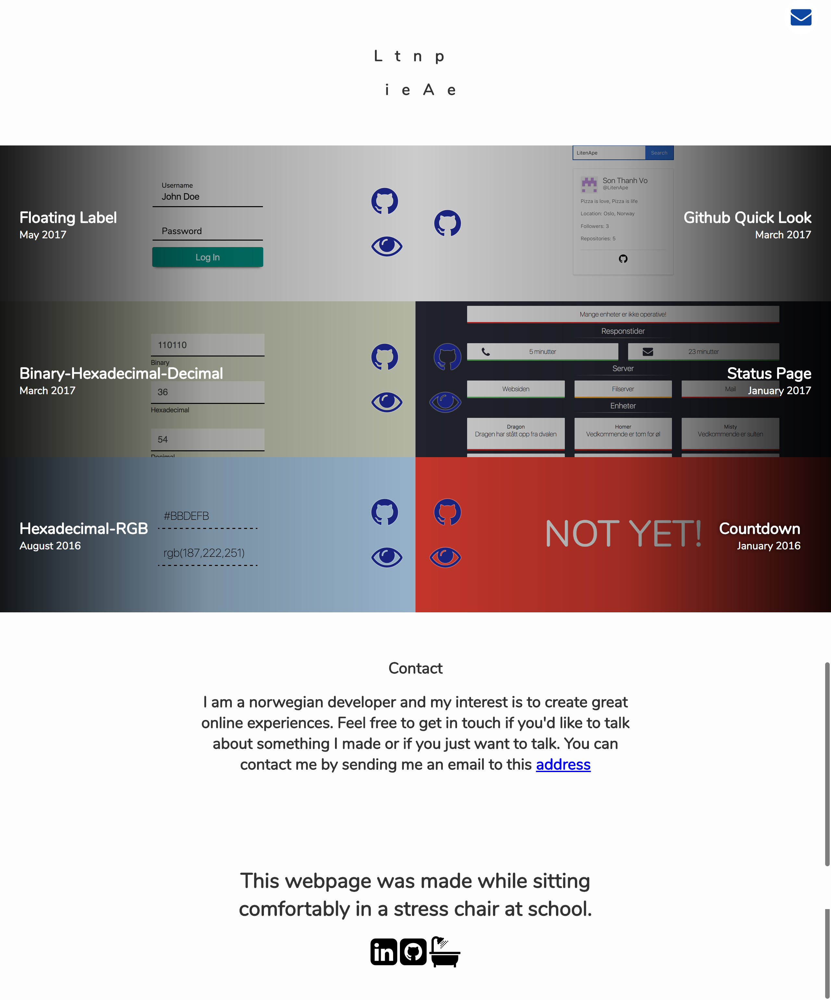
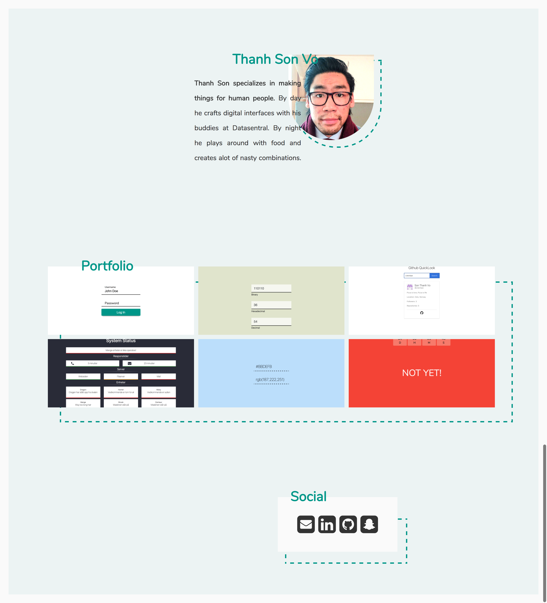

# General

After a long break away from web development, I decided that I should try to update my portfolio page as a good training exercise. The first iteration was never meant to be used, but it did what I wanted it to, even tho it was ugly.

My main purpose with the first iteration was maintainability. Because of this, the main section of the page was generated from javascript. The projects and it's information is all html elements that was concatenated together and then added into to DOM. While this made it efficient and easy to add new projects and change links if needed to, it just didn't look good. The first thing that made me skeptical about the page was the parallax effect on the header. It looked cheap and never lined up the way I wanted too. The while thing was a big miss. The biggest problem with the whole effect was that I later found out that it behaved differently depending on the aspect ratios of the visitor. So while the page served it's purpose of displaying my side projects, it looked like I didn't know how to make an acceptable page, which destroyed the whole purpose of having the page in the first place. So I did like every other designer would do, I started to search after inspiration for how I could display my work in an acceptable way, in a way that needed as little changes as possible in the future. I also wanted the whole thing to be scalable and maintainable, so I scrapped the whole idea of generating the portfolio section with javascript and the decided to structure the html in a more readable manner instead.

The second version, and the version that is currently online is a much more eastically pleasing webpage that does what I think is a better way to display my work. Not only is the cheap effects removed, but the pictures of the projects is also much more visible and because the overlay was removed. The contact section was removed, because I think it is awkward to tell you the visitor that you can indeed contact me, when that is a obvious option when visiting a portfolio page. Even tho the header is pulling down the overall score for the whole page, I am pleased with the outcome, so until my exams are over and I got myself a full-time job, the header will stay as it is. Sorry.
