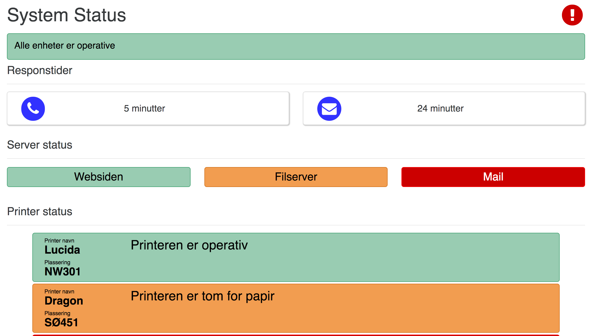
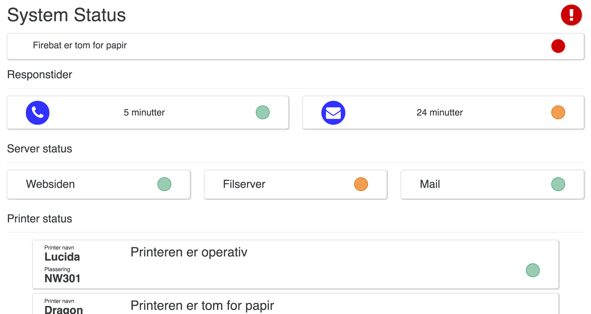
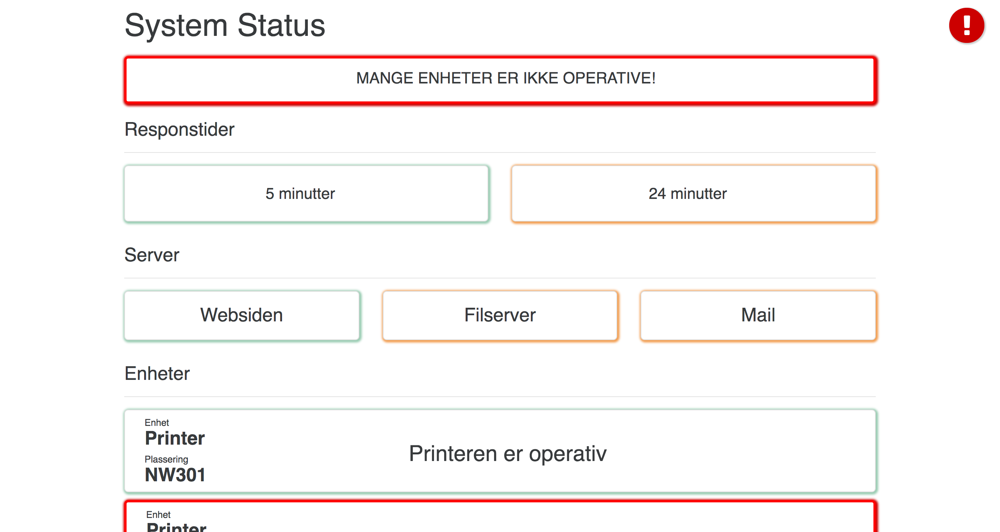
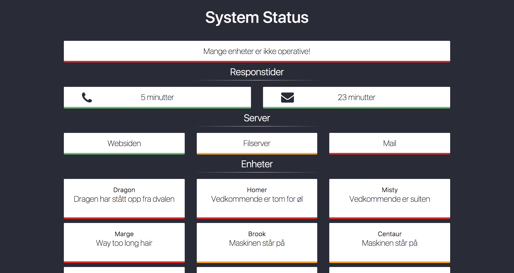

# General

The webpage was created as a concept of how Datasentral's status page could look like. The idea was to create a minimalistic and aestically pleasing so it could be used with little modification when they were ready with the development for their new service option targeted at small to medium companies. I wanted everything to be as generic as possible, for the service to be both maintainable and scalable.

Everything started with a quick template that was made to gather feedback about what kind of layout I wanted, and how I should iterate over that layout.

Here you can see that everything is bright and colourful, mainly because I though a colourful design was the way to go. I thought that the the colours would be able to convey their message much better if the the attention of the visitor got grabbed right away. This didn't turn out the way i wanted, and the colours made it more unprofessional and childish then i wanted it to be.

After collecting the feedback for the first iteration, I started working on the next iterations, with the colours and how to convey the different messages without being to loud.

In the second iteration, the amount of colour were reduced, while they still were able to convey their status without needing to actually write things out, it still didn't feel professional and the dots just didn't look good at all.

The third iteration was quickly thrown out too because it just looked cheap. I understood that the colours was just wrong, and that it didn't matter how much changes I made to how they were displayed, I had to do much larger changes then to just move the colours.

The fourth and almost final iteration of the design received much more work the the first version. The fourth version received a darker background colour, so that the status colours would pop more, without having to use strong colours. This change made the page look more minimalistic and professional, and I was quite happy with the result. The colours was moved to a bar instead to be more stealthy while still accessible, and the device statuses was reduced in width to be able to display more information on a smaller area.

Even tho the last iteration were never finished, to is still waiting for the service option to be started again. Because this is something I made for a company, the last version of my iteration will not be published here until the service is online and offered to customers
